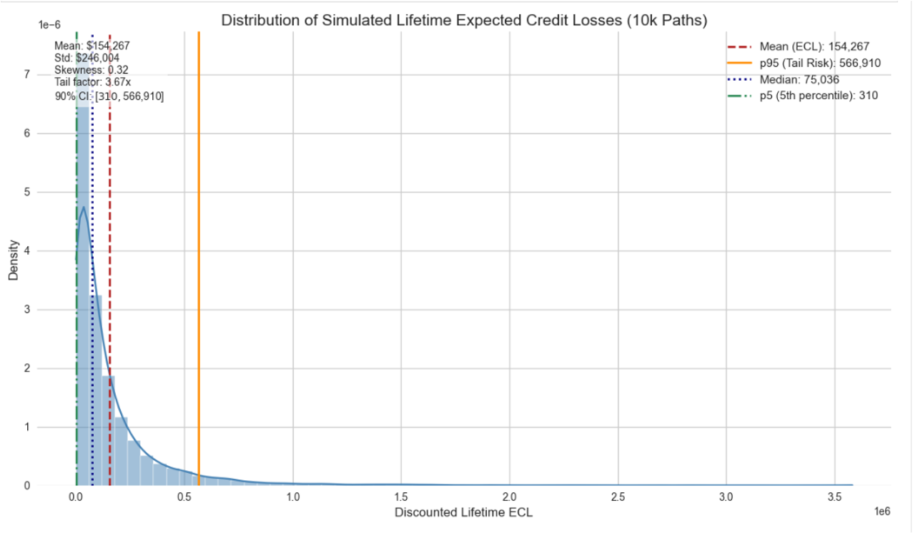

# Corporate-Credit-Risk-Modeling
## Overview
- This project implements an IRB-inspired corporate credit-risk modeling framework, for borrower-level PD estimation and calibration, internal rating-band construction, and IFRS 9-style lifetime Expected Credit Loss (ECL) calculation.
- The project uses a synthetic two-cohort corporate dataset with a time-split validation design: the 2023 cohort is used for model training, while the 2024 cohort is used for out-of-sample testing, calibration, rating-band validation, and ECL estimation.
- The modeling pipeline covers: logistic regression with Weight of Evidence (WoE) feature engineering, Prior Correction for probability calibration under severe class imbalance, rating-band design with statistical validation, 12-month and lifetime ECL calculation, multi-period PD projection using three approaches (CAR, matrix powering, and S&P transition-rate anchoring), stochastic LGD and EAD modeling, Gaussian copula dependence modeling for the Monte Carlo simulation of lifetime ECL.
 

## Methodological Positioning
- As for credit risk analysis and monitoring, there are generally three layers: accounting/statistical PD model with rating bands, market-implied credit risk and structural/portfolio credit risk.

| Layer | Interpretation |
|----------|-----------------------|
| Statistical PD | Real-world/PiT PD, estimated from borrower fundamentals |  
| Market-implied credit risk | Risk-neutral hazard rate/default intensity, inferred from CDS or risky bond spreads |
| Structural/portfolio credit risk | Firm-value default mechanism and correlated default dependence |

- This project is from a risk-management perspective, rather than a market-pricing perspective. Its calibrated PDs should therefore be interpreted as a real-world, Point-in-Time (PiT) default probabilities, calibrated to match observed default rates, not as risk-neutral default probabilities implied from traded CDS spreads, with the purpose of internal credit monitoring.
- This positioning allows the project to remain interpretable and model-governance friendly while still incorporating professional credit-risk concepts, such as hazard-rate survival logic, migration-driven PD term structures, recovery uncertainty, and dependence modeling.

## Key Technical Contributions
- Built an interpretable Logistic-WoE PD model with monotonicity checks and IV-based feature selection.
- Applied prior correction to address probability distortion from class-weighted training.
- Designed a 6-band internal rating scale with Wilson, Clopper-Pearson, O/E, and chi-square validation.
- Compared CAR, matrix powering, and S&P multi-horizon anchoring for lifetime PD projection.
- Modeled LGD using a beta-distribution core with empirical tail splicing.
- Projected EAD through amortization, rating migration, and bootstrapped residual shocks.
- Introduced Gaussian copula dependence between default risk and recovery severity for Monte Carlo lifetime ECL.

## Data and Validation Design
-  The base dataset is a two-year synthetic corporate cohort comprising 3500 firms, allowing for rigorous out-of-sample temporal validation across the 2023 and 2024 cohorts.

## PD Model
- To ensure the model remains interpretable and regulatory-friendly, the core classifier is an L2-regularized Logistic Regression. The assumption of this discriminant function is a linear-in-log-odds relationship between features and default probability.
- To satisfy this linearity assumption, non-monotonic features are binned by quantiles and transformed using Weight of Evidence (WoE). 
- Features exhibiting an Information Value (IV) below the threshold (i.e. 0.02) are systematically discarded.
- Coefficient stability is validated using bootstrap samples.  All features maintain economic signs across 95% confidence interval, yielding a highly stable mean Out-of-Sample ROC-AUC of 0.8100, and a low standard deviation 0.0165 (<0.02).

## Calibration
- Credit datasets inherently suffer from severe class imbalance. To rectify the extreme over-prediction caused by balanced-weight training, a Prior Correction formula (Bayesian posterior rescaling) is applied. It reduces the Expected Calibration Error (ECE) to a negligible 0.0150.
- Platt Scaling, applied on top of Prior-corrected probabilities, changes ECE from 0.0150 to 0.0218. This deterioration indicates  the remaining calibration error, after the implementation of Prior correction, is already below the noise floor of any learnable pattern on this sample size.
  
## Rating System
- The rating band construction in this project mirrors Basel II/III IRB requirements: monotonicity, statistical reliability and discriminatory granularity.
- The portfolio is segmented into 6 distinct rating bands. The bands are validated utilizing binomial confidence intervals (Wilson score intervals and Clopper-Pearson exact binomial tests), Observed/Expected (O/E) ratio and Chi-square tests.
- Band 6’s statistically significant overestimation triggers a Red traffic light, flagging recalibration or a conservative Margin of Conservatism (MoC).
- The identification of conservatively miscalibrated band 6 does not invalidate the overall discriminatory structure but signals a localized tail calibration issue.

## ECL Engine
- The multi-period loss projection engine is built on the standard ECL equation.

### Lifetime PD Projection
- This project implements three methods, reflecting a spectrum of model sophistication.

| Method | Assumption | Hazard Shape | Use Case |
|--------|------------|--------------|----------|
| CAR | i.i.d. Bernoulli trials per year | Flat (constant) | Simple ECL, short horizons |
| Matrix Powering | Time-homogeneous Markov chain on rating states | Hump-shaped (migration-driven) | IFRS 9 lifetime ECL, Basel IRB |
| S&P Multi-Horizon Anchoring | Long-run average external rates, static log-linear scaling, no migration | Monotone, flatten at long horizons | Benchmarking, regulatory overlays |

- The matrix powering approach P^n is selected as the primary inputs.
- P is the 1-year S&P transition matrix recalibrated to internal PDs (predicted and corrected PDs in 2024) via a survival power scalar.
-  Utilizing Markov chain properties, the matrix is powered to extract marginal multi-horizon PDs, effectively capturing the convexity of default accumulations through credit downgrades over time.  

### LGD and EAD Modeling
- LGD is modeled semi-parametrically. LGD is bounded in (0, 1) and empirically near-symmetric with slight platykurtosis in the dataset, consistent with Beta distribution.  However. the tails exhibit regime-driven behavior,  so the extreme tails utilize empirical CDF splicing to account for discrete, regime-driven legal and recovery outcomes.
- The  Probability Integral Transform(PIT)/ the Inverse Transform Theorem enables simulation directly from this hybrid CDF.
- The  mild maturity effect on LGD is modeled via deterministic logit-space drift to prevent boundary violations.
-  EAD is modeled via a lognormal distribution. To be of Basel IRB consistency, EAD paths are simulated conditionally on the same Markovian credit state transitions driving the PD migrations.
- The decomposition into a deterministic amortization backbone, a rating-specific utilization drift, that is monotonic with credit deterioration, and i.i.d. bootstrapped residuals ensures structural alignment and regulatory alignment.
- The key efficiency insight is collapsing the obligor dimension to representative cohort paths by rating, weighted by initial exposure, which reduces the simulation scale without sacrificing the rating-migration dynamics.

### Dependence Modeling
- A consequential component of modeling is capturing the dependency structure between default likelihood and recovery severity. The non-trivial correlation between PD and LGD reflects latent systematic risk.
- A Gaussian copula is used as a tractable dependence engine to impose rank dependence between default-risk states and LGD severity in the lifetime ECL simulation. Cholesky decomposition, via a lower triangular matrix,  generates correlated latent normal variables, which are mapped through marginal distributions using inverse-CDF transforms, driving joint PD and LGD migrations.
- The Gaussian copula’s key limitation, constant correlations and lack of tail dependence, makes it less appropriate for stress scenarios, while a Student’s t-copula or Clayton copula would be preferred  for stress testing applications where tail dependence spikes during crises.

## Pipeline Structure

- This project connects three layers of credit-risk analysis: statistical credit risk, rating-system design and lifetime credit loss projection.

```
Corporate Credit Risk Modeling
│
├── 1. Dataset & EDA
│   ├── Synthetic two-cohort corporate data (2023 train / 2024 test)
│   ├── Feature significance: t-tests, KDE, correlation matrix
│   └── Base logistic model, L2, grid search, stratified K-fold (AUC: 0.772)
│
├── 2. Feature Engineering
│   ├── Monotonicity checks (PD vs. feature quantile bins)
│   ├── WoE transformation (roa, current_ratio, total_assets, revenue_growth)
│   ├── IV-based feature selection (drop: total_assets, revenue_growth)
│   └── WoE-logistic model (AUC: 0.806)
│
├── 3. Regression & Diagnostics
│   ├── Stratified K-fold CV (handles class imbalance)
│   ├── Bootstrap stability (1000 samples, all CIs exclude 0)
│   ├── Mean AUC (model stability) : 0.810
│   └── Out-of-sample (2024) AUC: 0.776
│
├── 4. Calibration
│   ├── Prior Correction (ECE: 0.325 → 0.015)
│   └── Platt Scaling on top(ECE: 0.015 → 0.022, rejected)
│
├── 5. Rating Band Design
│   ├── 6-band system (Chi-square merging for monotonicity)
│   ├── Wilson + Clopper-Pearson binomial tests per band
│   ├── O/E ratio traffic light system
│   ├── Chi-square test across bands
│   └── Band 6: Red flag (overestimation, p = 0.001)
│
├── 6. ECL Calculation
│   ├── 12-month ECL (PiT, IFRS 9 Stage 1-style provisioning)
│   ├── Multi-period PD: CAR / Matrix Powering / S&P Anchoring
│   ├── LGD: Beta core + empirical tail splicing + logit-space drift
│   ├── EAD: Lognormal + rating-conditional amortization
│   ├── PD–LGD copula: Gaussian + Cholesky decomposition
│   └── Lifetime ECL (IFRS 9 Stage 2/3-style provisioning): E[ECL] = 154,267 | P95(95% upper tail) = 566,910 | Tail factor 3.67×
│
└── 7. Future Work
    ├── XGBoost diagnostic (non-linearity / interaction detection)
    ├── Band 6 remediation (Bayesian shrinkage / MoC overlay)
    ├── Scenario-adjusted PiT PD (Vasicek macro-overlay on hazard rates)
    ├── Enhancement of EAD modeling (generalized Pareto distribution on tails)
    ├── Stress test of Lifetime ECL (scenario analysis: shock multipliers, macroeconomic mapping)
    └── Alternative approach to Gaussian Copula (Student’s t-copula or Clayton copula)

```

## Main Results

| Metric | Value | Interpretation |
|--------|-------|----------------|
| Base model AUC (train) | 0.777 | Acceptable discrimination baseline |
| WoE-logistic AUC (CV) | 0.806 | Improved feature engineering |
| Bootstrap Mean AUC | 0.810 (σ = 0.017) | Robust, narrow variance |
| Out-of-sample AUC (2024) | 0.776 | Stable generalisation, no material overfit |
| Pre-calibration ECE | 0.325 | Severe miscalibration (balanced weighting effect) |
| Post-prior-correction ECE | 0.015 | Excellent calibration |
| Expected Lifetime ECL | 154,267 | IFRS 9 provision to book |
| P95 Lifetime ECL (95% upper tail) | 566,910 | Tail risk: 3.67× mean |
| Band 6 Binomial test (Wilson score interval) Traffic Light | Red | Recalibration flagged |

## Key Plots

### Distribution of Simulated Lifetime ECL



The plot shows right-skewed, mass near zero, and occasional large-loss scenarios, which are classic features of credit risk Monte Carlo output.

 
## Project Report
Full project report: [Project Report PDF](https://github.com/yuliniris/Quantitative-Finance-Projects/blob/main/Corporate_Credit_Risk_Modeling/Report/Credit_Risk.pdf)

## Code Structure
- **Dataset_analysis:**   Feature significance, base logistic model.
- **Feature_engineering:**  Monotonic checks, WoE transformation, WoE-logistic model.
- **Logistic_model_calibration:**   Stratified K-fold CV, bootstrap stability, out-of-sample, Prior correction, Platt scaling.
- **Rating_band_validation:**   Band system, PD rating band validation.
- **ECL_simulation:**   12-month and lifetime ECL.


## Limitations and Future Work
- The PD model is trained on a synthetic two-year corporate dataset. A production implementation would require longer default histories, macroeconomic variables, sector information, the through-the-cycle (TTC) vs PiT reconciliation, though current model demonstrates stable discrimination and calibration.
- The highest-risk rating band shows statistically significant conservative miscalibration, which suggests localized tail remediation, though it does not invalidate the overall rating structure. Possible treatments include Bayesian shrinkage, targeted recalibration of the highest-risk band, or a margin-of-conservatism (MoC) framework.
-  Lifetime PD projection is based on S&P style transition matrices and matrix powering, which is assumed to be time-homogeneous. A more advanced framework would introduce macro-conditional transition matrices or a systematic credit factor, such as Vasicek macro-overlay.
- The Gaussian copula used for dependence modeling is tractable but limited. Its assumption of constant-correlation structure may understate nonlinear tail dependence, especially in crisis regimes. Future extensions could consider t-copula or Clayton copula.
- XGBoost with SHAP values can provide a non-parametric benchmark, thereby serving as a diagnostic tool to check whether the logistic model has missed crucial non-linearities or interaction effects.
- EAD is modeled via lognormal distribution, and possible enhancement of tail is Generalized Pareto Distribution(GPD).
- Stress testing and scenario analysis may be combined to lifetime ECL calculation, such as shock multipliers, macroeconomic mapping and drawdown scenario.
 
## References
- Altman, E.I. (1968). Financial Ratios, Discriminant Analysis and the Prediction of Corporate Bankruptcy. Journal of Finance.
- Basel Committee on Banking Supervision (2006). International Convergence of Capital Measurement and Capital Standards (Basel II). BIS.
- Duffie, D. & Singleton, K.J. (1999). Modeling Term Structures of Defaultable Bonds. Review of Financial Studies. .
-  EBA (2017). Guidelines on PD estimation, LGD estimation and the treatment of defaulted exposures (EBA/GL/2017/16).
- IASB (2014). IFRS 9 Financial Instruments.  .
- Li, D.X. (2000). On Default Correlation: A Copula Function Approach. Journal of Fixed Income.
- CQF project workshop materials.
 
 