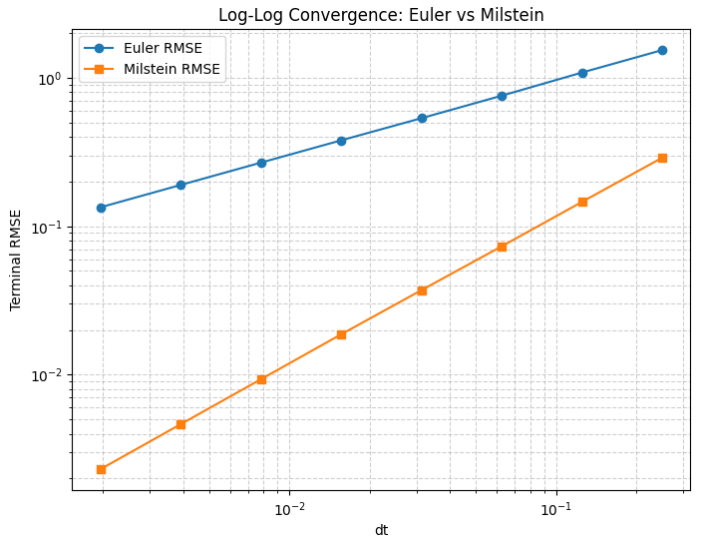
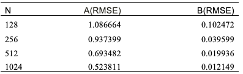
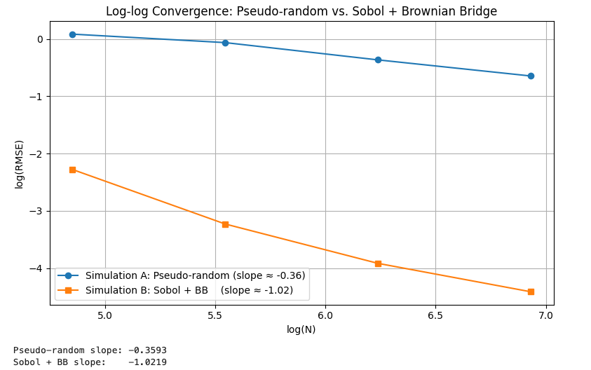
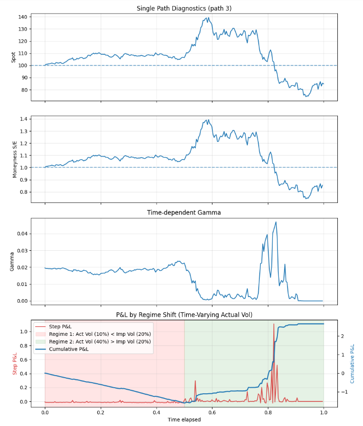

# Hedging Analysis with Greeks
## Overview
- This project studies the profitability and risk of delta-hedged option portfolios. It implements numerical simulation of geometric Brownian motion via Euler-Maruyama, Milstein schemes and Brownian bridge with Sobol sequences. It also examines the role of Gamma, gamma scalping and regime shift in realized volatility in shaping the profitability of a delta-hedged option position.

## Objective
- To compare the profitability and risk of delta-hedging using actual vs implied volatility.
- To quantify the impact of Gamma and gamma scalping.

## Research Questions 
- Simulate GBM paths using Euler-Maruyama and Milstein schemes.
- Simulate GBM paths using Brownian bridge with Sobol low-discrepancy sequences.
- Comparison of hedging with actual volatility and implied volatility.
- Analyze the impact of time-dependent Gamma and gamma scalping on P&L, including regime shift in realized volatility.

## Framework Comparison
- The table below maps each hedging case across the continuous-time theoretical derivation, the discrete-time simulation, and the underlying measure assumption.

| Dimension | Hedge with Actual Volatility | Hedge with Implied Volatility | 
|---|------|------| 
| P&L formula (continuous) | Total P&L = V_a(0) − V_i(0); path-independent  | Accumulated P&L = ½∫(σa² − σ_i²)S²Γ dt; path-dependent, drift-only | 
| P&L formula (discrete sim) | Random mark-to-market path with diffusion term; mean converges to theoretical value | Smooth drift-dominated path; no diffusion term in per-step increment |
| P&L nature | Model-based theoretical benchmark; not a trading strategy | Practical variance-spread framework; tradeable framework used by volatility desks |  
| Measure assumed | Risk-neutral (μ = r); drift cancels in delta-neutral portfolio | Risk-neutral (μ = r); same assumption — drift suppressed by hedging |  
| Real-world desk (physical measure) | Drift μ − r re-enters as a carry term when hedging is discrete | Funding cost and transaction costs erode the variance-spread P&L |  
| Hedging error | Zero under continuous rebalancing; non-zero, path-dependent in discrete time; discretization error widens with coarser δt | Gamma exposure  (high Gamma near expiry or ATM) and realized vs implied variance at regime boundaries drive P&L dispersion |  

## Methodology
- Geometric Brownian motion(GBM) simulation
- Euler-Maruyama scheme and Milstein scheme
- Error analysis using terminal-value RMSE and log-log convergence plots
- Sobol low-discrepancy sequences and Brownian bridge path construction
- RMSE-based variance reduction comparison: pseudo-random vs Sobol + Brownian bridge
- Mathematical derivatives of mark-to-market P&L for delta-hedged portfolios
- Gamma scalping P&L approximation
- Convexity premium 
- Regime-shift analysis for time-varying realized volatility

 

Two simulations are:

|  —  | Random number generator | Path construction | Brownian motion type |
|----|-----|-----|-----|
| Simulation A | Pseudo-random (i.i.d. standard normals) | Sequential increments | Standard Brownian motion built forward step-by-step |
| Simulation B | Sobol sequence (low-discrepancy quasi-random)| Brownian Bridge (hierarchical, dyadic) | Brownian Bridge process conditioned on terminal value, filled recursively |

## Main Results
- Euler-Maruyama and Milstein generate visually similar GBM paths and terminal distributions, with no remarkable distinctions, though Milstein achieves higher pathwise accuracy.
- Terminal-value error checking confirms the expected convergence behavior: Euler strong convergence slope is close to 0.5, and Milstein strong convergence slope is close to 1.
- Brownian bridge with Sobol sequence produces well-behaved paths and reduces variance through low-discrepancy sampling.
- RMSE values shows that Sobol + Brownian Bridge consistently outperforms pseudo-random scheme by a wide margin at every sample size.
- The log-log plot shows that pseudo-random scheme exhibits a slope of approximately -0.36, while Sobol sequence plus Brownian Bridge has a slope near -1.02, indicating much faster quasi-Monte Carlo convergence in this parameter range.
- When hedging with actual volatility, terminal profit converges to a value consistent with the theoretical formula (simulated mean 3.858 vs theoretical 3.781), but the mark-to-market path is random.
- When hedging with implied volatility, the local P&L increment follows the variance-difference structure, and the profitability depends heavily on Gamma exposure and variance spread.
- P&L of delta-hedged options depends heavily on Gamma exposure: whether the spot price stays near the strike (the high Gamma zone), or drifts away as maturity approaches.
- P&L is also affected by the regime shift. A long-gamma position benefits from convexity When realized variance exceeds implied variance;  when realized variance is below implied variance, theta decay dominates and the position tends to lose money.

## Key Plots

### Log-log Convergence: Euler vs Milstein

The plot shows that Euler slope ≈ 0.5 and Milstein slope ≈ 1, derived from root mean square error (RMSE) values. Euler error is larger than Milstein error, and the error gap becomes more pronounced at smaller dt, consistent with strong-order 0.5 vs 1.

### RMSE Results

The table shows that Simulation B consistently outperforms Simulation A by a wide margin at every N, typically delivering an order-of-magnitude smaller RMSE.

### Log-log Convergence: Pseudo-random vs Sobol + Brownian Bridge

The log-log plot highlights the difference in convergence speed: the pseudo-random scheme exhibits a slope of approximately -0.36, while Sobol sequence plus Brownian Bridge has a slope near -1.02, indicating much faster quasi-Monte Carlo convergence in this parameter range.

### Gamma Scalping Simulation

- The plots show gamma scalping simulation and regime shift involved.

- For the regime with lower realized volatility (red zone), the position suffers a net loss, since theta decay dominates, and gamma scalping is insufficient.

- For the regime with higher realized volatility (green zone), delta-hedged portfolio generates profits, pushing the cumulative P&L positive, driven by the long gamma position.

## Project Report
Full project report: [Project Report PDF]( https://github.com/yuliniris/Quantitative-Finance-Projects/blob/main/Hedging_Analysis_with_Greeks/Report/Hedging_Analysis_with_Greeks.pdf)

## Code Structure
- **GBM_simulation:**   Euler-Maruyama and Milstein GBM paths simulation
- **Compare_schemes_error:**    RMSE error analysis and log-log convergence plots
- **Brownian_bridge_sobol:**  Quasi-random path construction with Sobol + Brownian Bridge, comparison of variance reduction
- **Simulation_PL_actual_vol:**   Delta-hedge P&L with actual volatility
- **Simulation_PL_implied_vol:**   Delta-hedge P&L with implied volatility
- **Gamma_scalping:**   Gamma scalping and regime shift simulation

## Assumptions and Limitations
This project uses a simplified framework:
- The underlying asset follows geometric Brownian motion
- Black-Scholes assumptions are used in the hedging derivations
- Continuous-time formulas are compared with discrete-time simulations
- No transaction costs, jumps, or stochastic volatility are included in the baseline setting

## Future Work
Possible extensions include:
- Apply a volatility surface (local volatility or stochastic volatility): allow various implied volatility for different strikes.
- Use a regime-switching model, such as Markov switching to simulate the actual volatility path
- Model transaction costs and discrete rebalancing frequency optimization
- Compare delta-hedged option P&L with variance swap exposure

## References
- Peter Jackel. Monte Carlo Methods in Finance. Wiley & Sons, Incorporated, John, November, 2002
- John Hull and Alan White. "Optimal Delta Hedging for Options." Journal of Banking and Finance, Vol. 82, Sept 2017: 180-190, May,2017
- Project workshop of CQF
- Understanding volatility, CQF

 

