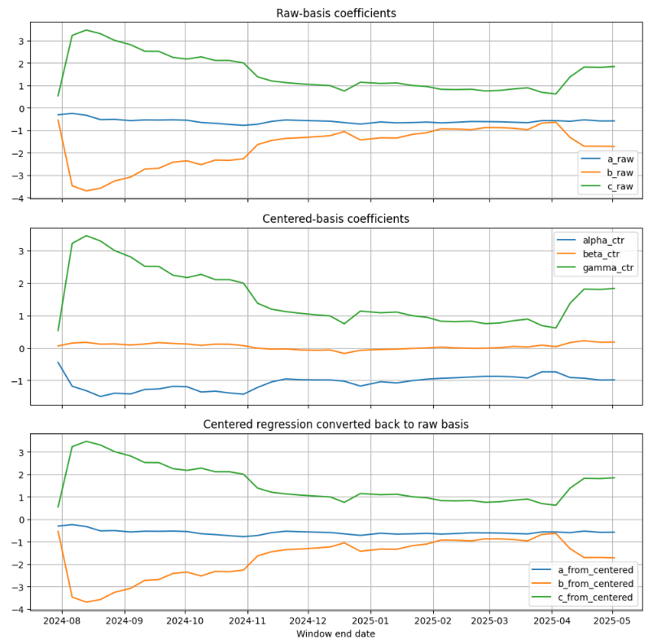
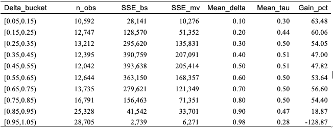
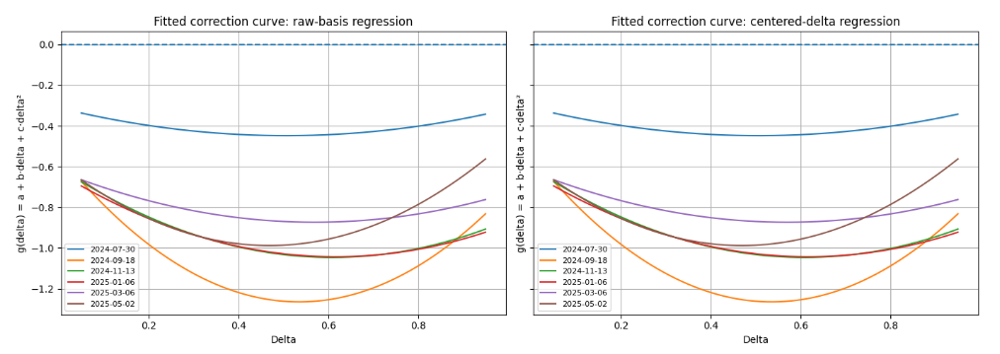
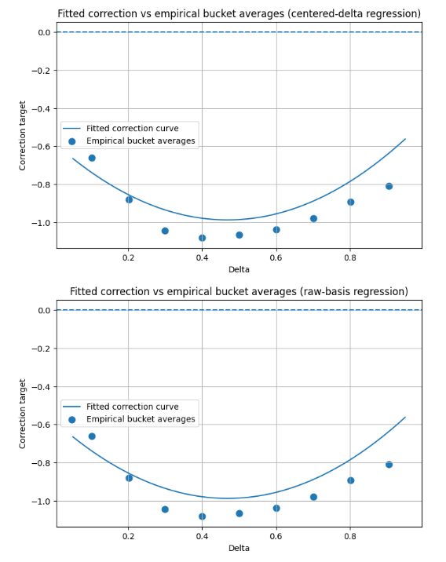

# Minimum Variance Delta Hedging

## Overview
- This project studies hedge-ratio misspecification in delta hedging, which can arise when implied volatility co-moves with the underlying asset price and creates residual volatility exposure.
- Standard Black-Scholes delta hedging assumes constant volatility and continuous rebalancing. In practice, implied volatility changes with the underlying asset price, and hedging is performed discretely. As a result, Black-Scholes delta hedging can leave residual hedging error.
- The project implements a minimum-variance delta hedging framework inspired by Hull and White's research. It uses a synthetic SPY option panel built from historical SPY prices, VIX as an implied-volatility anchor, and a quadratic log-moneyness volatility surface. 
- The purpose is to estimate a correction to standard Black-Scholes delta by incorporating the predictable component of implied volatility changes that co-move with the underlying asset price. 
- The correction term is estimated through pooled panel regressions and evaluated across delta buckets.

## Objective
 - Estimate the minimum-variance delta correction using the Hull-White quadratic regression structure.
- Compare the sum of squared hedging errors under Black-Scholes delta and minimum-variance delta.
- Analyze the empirical bucket-level average correction to assess whether the fitted correction term is stable and economically interpretable across the delta range.

## Research Questions
-  How much hedging error reduction does minimum-variance delta achieve relative to Black-Scholes delta?
-  How does the hedging improvement vary across delta buckets?
-  Is the fitted correction term stable and economically interpretable?

## Methodology
The implementation follows the research's development from theory to empirical estimation.

### Theoretical formula
The minimum variance delta is:

$$\Delta_{MV} = \Delta_{BS} + \text{vega}_{BS} \cdot \frac{d\mathbb{E}[\sigma_{imp}]}{dS}$$

- It is the local asymptotic expansion and optimal instantaneously. The hedge ratio minimizes the variance of the hedging error over an infinitesimal time interval, rather than achieving global replication over the option’s life.

### Empirical structure for the volatility sensitivity
$$\frac{d\mathbb{E}[\sigma_{imp}]}{dS} = \frac{1}{S_t\sqrt{T}}\left(a + b\Delta_{BS} + c\Delta_{BS}^2\right)$$

Substituting into the MV delta formula gives the regression specification:

$$y_t = a + b\Delta_{BS,t} + c\Delta_{BS,t}^2 + \varepsilon_{MV,t}$$

where the dependent variable is:

$$y_t = \left(dV - \Delta_{BS,t}dS\right)\frac{S_t}{dS}\frac{\sqrt{T}}{\text{vega}_{BS,t}}$$

the correction term:

$$\Delta_{MV} - \Delta_{BS} = \frac{\text{vega}_{BS}}{S_t\sqrt{T}}\left(\hat{a} + \hat{b}\Delta_{BS} + \hat{c}\Delta_{BS}^2\right)$$

- The changes discussed here, including dV, dS, dσ_imp, are observed in the real world, not the artificial risk-neutral measure. The negative correlation of underlying price and implied volatility is a real-world empirical fact, not from risk-neutral pricing.

### Synthetic option panel generation  
Two volatility-surface generators are considered for the empirical implementations (first attempt and revised approach):

- **SVI-based generator:** abandoned because the nonlinear square-root structure and parameter collinearity produce unstable implied volatility sensitivities. 

- **Quadratic log-moneyness generator:** adopted because it provides smoother and more stable implied volatility dynamics for regression-based hedging analysis.

$$\sigma_{\mathrm{imp}} = \mathrm{base\_iv} + \mathrm{curvature\_term} + \mathrm{skew\_term} + \mathrm{noise}$$

$$\mathrm{base\_iv} = \mathrm{base}_0 \cdot \left(1 + \alpha \cdot e^{-\mathrm{decay} \cdot T}\right)$$

$$\mathrm{curvature\_term} = \left(\mathrm{curvature}_0 + \mathrm{curvature}_1 \cdot e^{-\mathrm{curvature\_decay} \cdot T}\right) \cdot x^2$$

$$\mathrm{skew\_term} = \mathrm{skew}_0 \cdot e^{-\mathrm{skew\_decay}\cdot T} \cdot x$$

$$
\mathrm{noise} \sim \mathcal{N}\left(0,\ \mathrm{noise\\_std}^{2} \left(1 + \mathrm{wing\\_noise\\_scale} \cdot |x|\right)^{2} \right)
$$

x : log-moneyness

$x = \log(E/F)$ where $E$ is the strike price and $F = Se^{rT}$ is the forward price

- **Principles of functional form:**
1) base_iv: control the ATM volatility regime

2) base_0: use VIX index as reference

3) curvature_term: create smile/smirk convexity; term-dependent; short-dated smiles are morel convex, because near-expiry gamma risk is priced aggressively

4) skew_term: create skew; negative; time-dependent; short-dated ones have stronger skew

5) noise: add randomness; smaller near ATM, and larger in far OTM. To avoid the dominance of noise, it is necessary to keep noise_std small for time-series dynamics and moneyness-dependent as well

6) Log-moneyness: log-forward moneyness; to make cross-maturity comparison more consistent.

 

- **Panel data structure:** track each option contract through time so that daily changes are computed along the same contract path rather than across different cross-sectional instruments.

### Methodology summary
- The following is the summary of the process of trials and failures.

| What Was Tried | What Failed | Why | Next Step |
|----|---|---|---|
| Strike grid and VIX index | The binary behavior of deltas' distribution | Lack of real-world market behavior, volatility surface and term structure | Try parametric model |
| SVI volatility surface | Wrong magnitudes of coefficients a, b, c; inconsistence of sign of c | Nonlinear square-root structure + parameter collinearity → unstable ∂[σ_impl]/∂S, which conflicts with the implicit assumption of empirical implementation | Switch to quadratic log-moneyness |
| Cross-sectional strike generation | Not time-series dataset of option price for the same contract | Differences are across instruments, not within a path → destroys Hull-White regression logic | Track each contract from issue date to maturity; time-series hedging along a path |
| Bucket-level quadratic regression | Coefficients unstable, numerically fragile | Delta range per bucket too narrow → hard to identify a stable quadratic | Estimate coefficients using all options in the rolling window, not within each delta bucket; report hedging performance based using observation-time delta bucket |

### Pooled panel regression for empirical estimation
- Estimate coefficients in pooled rolling-window regressions rather than inside narrow delta buckets, which improves numerical stability.
- The rolling-window size is 63 trading days, and the moving step size is 5 trading days.
- Construct the minimum-variance delta correction, compare squared hedging errors against Black-Scholes delta, and summarize results across dynamic delta buckets.
- Apply practical filters on tiny dS, delta, and vega, and use a burn-in period to remove immature early rolling windows, avoiding coefficient explosion.
- The burn-in period is first 3 windows.

### Regressions on raw dataset and centered-basis
- Due to the multicollinearity of Δ_BS,t and Δ_BS,t² , regression is also done on centered delta, centered Δ = Δ_BS,t - mean Δ.

### Empirical bucket-level average correction
- Compare fitted correction curve against empirical average within delta buckets as a diagnostic check.

## Main Results
- The pooled panel regression produces stable coefficient estimates after the initial burn-in period.
- The minimum-variance delta reduces squared hedging error by approximately 51% on the raw rolling sample and 63% after applying the burn-in filter.
- These Gains are materially higher than those reported in Hull and White's research, suggesting that the synthetic data-generating process is favorable to the minimum-variance hedge. The implied volatility surface is smooth, structured, and only lightly noisy, whereas real-market implied volatility contains idiosyncratic variation, time-varying skew and curvature, liquidity effects, and transaction costs.
- The centered-basis specification improves numerical stability without materially changing the fitted correction curve.
- Delta-bucket analysis shows positive Gains across most delta regions, while the extreme high-delta bucket is unstable and excluded from the trimmed evaluation.
- The pattern of Gains across delta buckets differs from Hull-White's empirical results. In this project, low-delta OTM and high-delta ITM call buckets show more comparable Gains. One possible reason is the synthetic panel's maturity structure: high-delta call options retain relatively long average maturities, so they retain meaningful vega and volatility sensitivity. In real markets, high-delta deep ITM calls are often closer to expiry, have lower time value and lower vega, and behave more like the underlying asset.  
- The fitted correction curve is negative across the delta range and approximately U-shaped, with the largest correction around the central delta region.

## Key Plots

### Regression Coefficients

The plot shows that centered-basis delta does not change the fitted curve. Centered-basis regression is preferable for numerical stability since the raw linear and quadratic delta terms are highly collinear over the practical delta range.

### Gain by Delta Bucket

The gain-by-bucket analysis shows how hedging improvement varies across the delta range. Most buckets show positive Gains, while the extreme high-delta region is unstable and is excluded from the trimmed evaluation. The relatively high gains in both low-delta and high-delta regions suggest that the synthetic option panel produces stronger volatility-price co-movement than would typically be expected in real option markets.

### Fitted Correction Curve

The fitted correction curve is negative and roughly U-shaped across the admissible delta range, with the deepest correction around mid-deltas.

### Empirical Bucket-Level Average Correction

The empirical bucket-level correction serves as a diagnostic check against the fitted correction curve.

## Project Report
Full project report: [Project Report PDF](https://drive.google.com/file/d/1ByXZW_LgbO8B0QWxFQe9cO7zJ1OLLET8/view?usp=sharing)

## Code Structure
- **SVI-based generation:**  initial parametric implied volatility surface, later abandoned due to numerical instability.
- **Quadratic surface generator:**  Quadratic log-moneyness implied volatility surface with maturity-dependent skew and curvature.
- **Pooled rolling-window regression:**  63-day rolling-window regression with burn-in and filters.
- **Delta bucketing and centered-basis:**  Performance evaluation, SSE comparison across dynamic delta buckets, and centered-delta regression for numerical stability diagnostics.

## Assumptions and Limitations
### Assumptions
- The analysis focuses on hedge-ratio misspecification caused by the co-movement between implied volatility and the underlying asset price.
- Discrete rebalancing error is not the main object of this project.
- The synthetic option panel is generated from historical SPY prices, VIX-based implied-volatility anchors, and a controlled quadratic log-moneyness volatility surface.

### Limitations
- The original SVI-based data generator was abandoned because it produced unstable implied-volatility sensitivities and unreliable regression coefficients.
- The adopted synthetic implied-volatility surface is smoother and more deterministic than real option markets, which likely inflates the measured hedging gains.
- The unbalanced panel can implicitly overweight longer-maturity contracts.
- Transaction costs, liquidity constraints, bid-ask spreads, and execution slippage are not included.

## Future Work
Possible extensions include:
- Introduce autoregressive dynamics into the implied-volatility generator, so skew and curvature evolve over time rather than remaining too rigid.
- Test the framework on real option-chain data to benchmark gains against empirical studies rather than favorable synthetic dynamics.
- Extend the analysis to put options separately and compare whether the fitted correction behaves differently across calls and puts.
 
## References
- John Hull and Alan White. *Optimal Delta Hedging for Options*. Journal of Banking and Finance, Vol. 82, Sept 2017: 180-190, May, 2017
- CQF project workshop materials.
 

 

