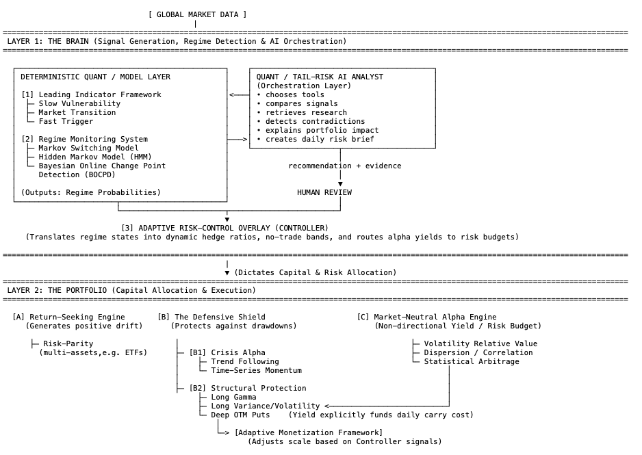
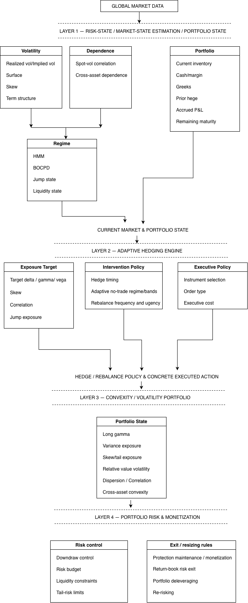
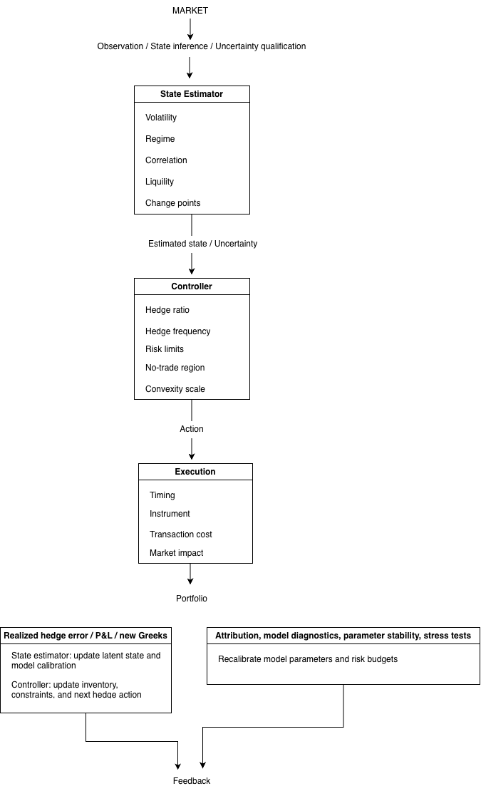

## Quantitative Finance Projects
- This collection develops an interpretable, regime-aware multi-asset portfolio architecture. It combines a diversified return core, persistent structural protection, and adaptive risk control. 
- The research objective is to quantify how protection changes drawdown and crisis survivability, and whether capacity-constrained market-neutral strategies can offset part of its persistent carry cost after transaction costs, liquidity frictions, and tail losses.
- The collection of projects demonstrates the understanding and implementations of pertinent theories and modelings.
- These projects are modules of the following portfolio framework.

## Framework of Portfolio Construction (conceptual architecture)
###  Structure


###  Implementation


###  Conception


- The diagrams are generated by AI, based on my multi-round conversations with chatbots.
- The idea of the portfolio construction is the robust-oriented asset allocation plus sophisticated risk control. 
- The long-term architecture, the closed-loop control-and-execution system, is conceptually motivated by stochastic control theory and partially observable Markov Decision Processes(POMDPs): latent market state is estimated from noisy observations, then translated into risk-allocation and hedge decisions.
- The portfolio contains three modules: return-seeking engine; the defensive shield; market-neutral alpha engine.
-  Return-seeking engine is a diversified beta core intended to harvest long-run systematic return premia.
- The defensive shield is the protection against drawdowns and tail risks. Particularly, a persistent, explicitly budgeted program of structural and adaptive protection is designed to reduce drawdown severity, gap loss, and forced-deleveraging risk.
- Market-neutral alpha engine is a set of long/short relative-value strategies, with low structural exposure to broad market beta, subject to residual factor, liquidity, funding, model, crowding, and tail exposures.
- The portfolio is supported by leading indicator framework and monitoring system, with assistance from AI analyst agent.
- The risk control is based on adaptive hedging, and funded by alpha yields(untested), consistent with the concept of self-sustaining defensive system, which is the future research that how market-neutral alpha and adaptive hedging sizing offset part of the persistent carry cost of structural convexity, improving the economic sustainability of protection (given the bitter lessons from California Public Employees' Retirement System (CalPERS)). It is a feedback controller of state-estimation-> uncertainty-awareness-> hedging-execution-> error-learning.
- The conceivable agent scheme is of functionalities of analysis, monitoring and orchestration. The proposed agent layer orchestrates predefined research, monitoring, diagnostic, and reporting tools subject to explicit permissions, validation rules, and human review. Also, a series of models are numerical engines to do calculations.

## Projects
### Connections to the Framework of Portfolio Construction 

| Hierarchy | Project | Fit | Role |
|:---|:---|:---|:---|
| **Flagship research modules-policy** | **Hedging Analysis with Greeks** | Layer 2 → B2 convexity-risk diagnostics | Gamma behavior, IV/RV P&L, discrete hedging, regime shifts |
| **Flagship research modules-portfolio position** | **Variance Swap** | Layer 1 options indicators + Layer 2 B2 & C | Variance exposure, implied variance, option-strip information |
| **Flagship research modules-hedging policy/methodology** | **Minimum Variance Delta Hedging** | Layer 2 → B2 / execution & adaptive hedge | Improve hedge ratio when spot and IV co-move |
| **Flagship research modules-sensor/risk engine** | **Credit Risk Modeling** | **Current implementation:** borrower-level interpretable credit-risk engine;<br>**Framework extension:** macro-conditioned credit deterioration / systemic vulnerability indicator; Layer 1 → Slow Vulnerability / credit layer | Fundamental/PiT credit deterioration, tail ECL, dependence |
| **Quantitative infrastructure** | **Monte Carlo Pricing** | Shared quantitative infrastructure, the scenario-generation engine for drawdown/tail-risk stress testing | Scenario/pricing/stress engine |
| **Experimental ML work** | **LSTM** | No direct connections | Its cointegration features fit statistical arbitrage |


### Hedging Analysis with Greeks
- This project studies the profitability and risk of delta-hedged option portfolios. It implements numerical simulation of geometric Brownian motion via Euler-Maruyama, Milstein schemes and Brownian bridge with Sobol sequences. It also examines the role of Gamma, gamma scalping and regime shift in realized volatility in shaping the profitability of a delta-hedged option position.
- Skills: Geometric Brownian motion(GBM) simulations,  Euler-Maruyama scheme and Milstein scheme, error analysis using terminal-value RMSE and log-log convergence plots, Sobol low-discrepancy sequences and Brownian bridge path construction, RMSE-based variance reduction comparison: pseudo-random vs Sobol + Brownian bridge, mathematical derivatives of mark-to-market P&L for delta-hedged portfolios, Gamma scalping P&L approximation, convexity premium, regime-shift analysis for time-varying realized volatility.
- Project link: (https://github.com/yuliniris/Quantitative-Finance-Projects/tree/main/Hedging_Analysis_with_Greeks)

### Variance Swap Replication
- This project is an extension of the project *Hedging Analysis with Greeks*. It extends the framework from delta-hedged vanilla call options to variance-linked exposure. This framework mirrors how variance swaps and VIX are priced and hedged on volatility desks. It develops connections from three perspectives: 1) the continuous-time log-contract replication identity; 2) the trading interpretation through a short log contract and constant-dollar stock hedge; 3) the static pricing of the fair variance strike implied by the OTM option strip.
- Skills: derivation of theoretical formulae: variance swap replication identity via Itô’s lemma, the static option strip replication formula; numerical experiments: discrete realized-variance estimators, normalized dollar-gamma exposures, a VIX-style discretization of the continuous option-strip formula.
- Project link: (https://github.com/yuliniris/Quantitative-Finance-Projects/tree/main/Variance_Swap_Replication)


### Minimum Variance Delta Hedging 
- This project studies hedge-ratio misspecification in delta hedging, which can arise when implied volatility co-moves with the underlying asset price and creates residual volatility exposure. The project implements a minimum-variance delta hedging framework inspired by Hull and White's research. It uses a synthetic SPY option panel built from historical SPY prices, VIX as an implied-volatility anchor, and a quadratic log-moneyness volatility surface. The purpose is to estimate a correction to standard Black-Scholes delta by incorporating the predictable component of implied volatility changes that co-move with the underlying asset price. 
- Skills: derivation of theoretical formula, empirical structure, synthetic option panel generations (SVI-based generator, quadratic log-moneyness generator), pooled panel regression for empirical estimation(raw dataset and centered-basis), empirical bucket-level average correction.
- Project link: (https://github.com/yuliniris/Quantitative-Finance-Projects/tree/main/Minimum_Variance_Delta_Hedging)


### Corporate Credit Risk Modeling
- This project implements an IRB-inspired corporate credit-risk modeling framework, for borrower-level PD estimation and calibration, internal rating-band construction, and IFRS 9-style lifetime Expected Credit Loss (ECL) calculation.
- Skills: logistic regression with Weight of Evidence (WoE) feature engineering, Prior Correction for probability calibration under severe class imbalance, rating-band design with Wilson, Clopper-Pearson, O/E, and chi-square validation, 12-month and lifetime ECL calculation, multi-period PD projection using three approaches (CAR, matrix powering, and S&P transition-rate anchoring), stochastic LGD and EAD modeling, Gaussian copula dependence modeling for the Monte Carlo simulation of lifetime ECL.
- Project link: (https://github.com/yuliniris/Quantitative-Finance-Projects/tree/main/Corporate_Credit_Risk_Modeling)

###  Monte Carlo Pricing
- Calculate option prices of various option types based on the simulation of underlying price paths, which are simulated using the Euler-Maruyama scheme
- Skills: the Euler-Maruyama scheme,  Monte Carlo Scheme
- Project link: (https://github.com/yuliniris/Quantitative-Finance-Projects/tree/main/Monte_Carlo_Pricing)


### Market Prediction using LSTM 
- Use LSTM neural networks on historical S&P 500 data to do prediction.
- Skills: feature engineering, correlation analysis, Augmented Dickey-Fuller unit root test, cointegration analysis, fine-tuning of parameters
- Project link: (https://github.com/yuliniris/Quantitative-Finance-Projects/tree/main/Trend_Prediction_Using_LSTM)


 
## Portfolio Hierarchy — Implemented vs Planned Modules

<pre>
```
Portfolio Hierarchy-Implemented vs Planned Modules

REGIME-AWARE MULTI-ASSET ADAPTIVE HEDGING AND DRAWDOWN_CONTROL SYSTEM

I. Quantitative Foundations
├── [Basic] Monte Carlo & numerical simulation —> Scenario engine
└── [Basic] Corporate credit-risk modeling —> Credit vulnerability

II. Volatility & Adaptive Hedging
├── [Implemented] Delta hedging / gamma scalping —> Gamma/volatility mechanics
├── [Implemented] Variance-swap replication —> Variance exposure
├── [Prototype] Minimum-variance delta hedging —> Adaptive delta hedging
└── [Next] Local/stochastic volatility

III. Market-State Intelligence
├── [Next] Correlation / PCA monitor
├── [Next] HMM / Markov switching regime detector
├── [Next] BOCPD
└── [Later] Credit vulnerability

IV. Portfolio Construction
├── [Later] Risk parity
├── [Later] Crisis alpha
└── [Next] Structural tail protection

V. Machine Intelligence
├── [Experimental] LSTM —> earlier experimental ML
├── [Later] Neural volatility forecasting
├── [Next-ish] RL adaptive hedging
└── [Next-ish] Risk AI Analyst agent
```
</pre>

