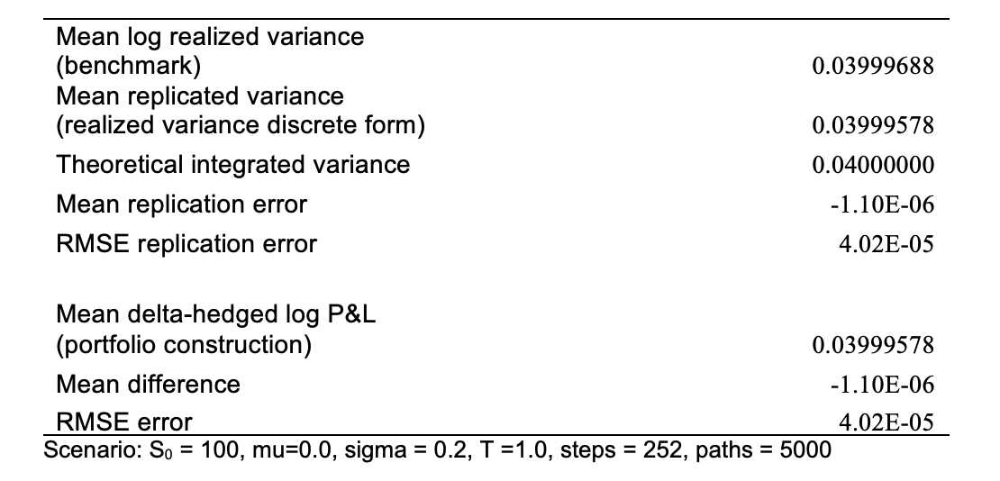
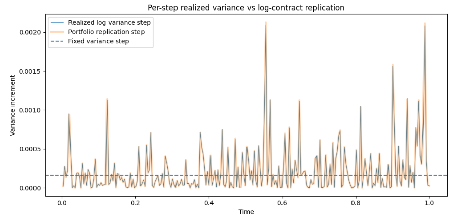
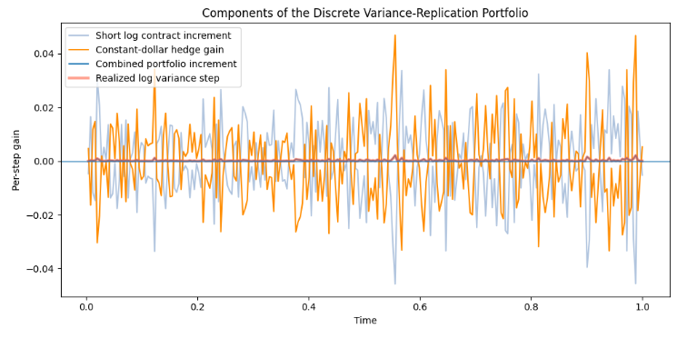
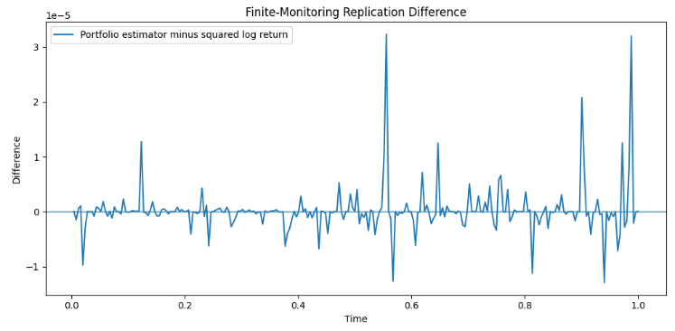
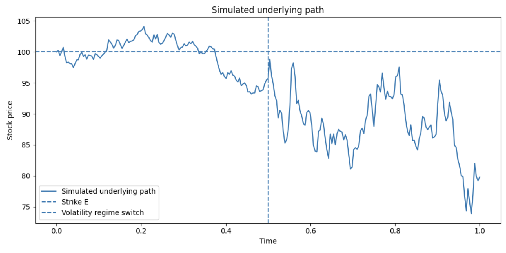
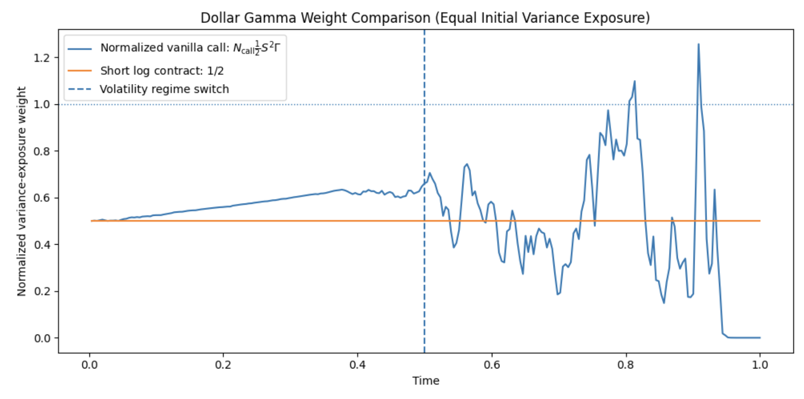
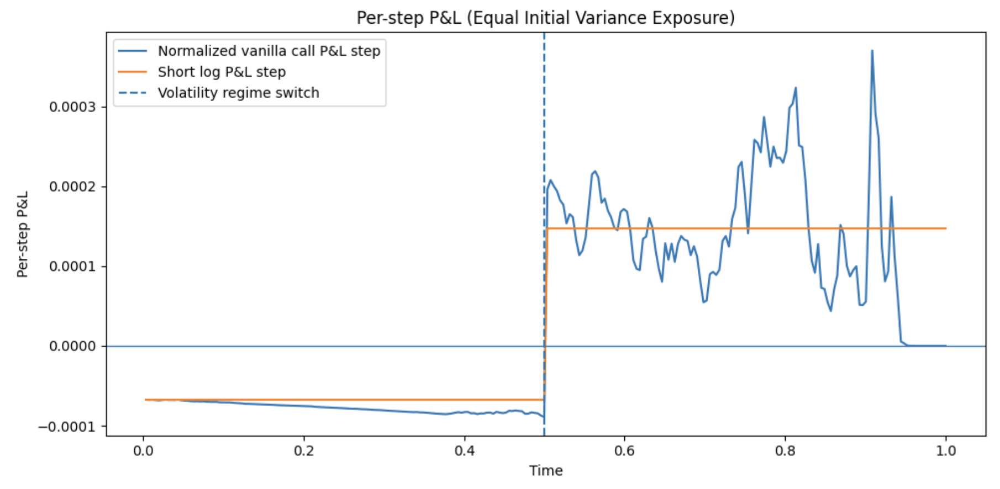
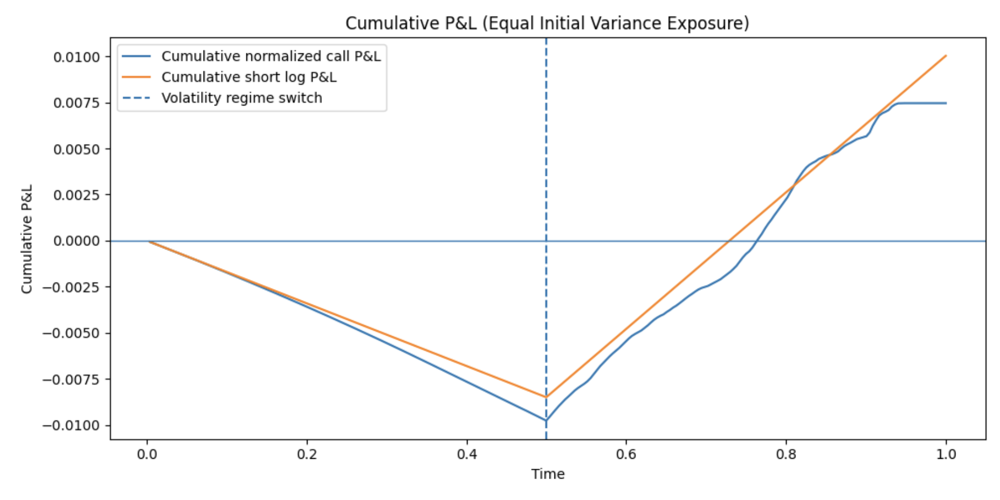
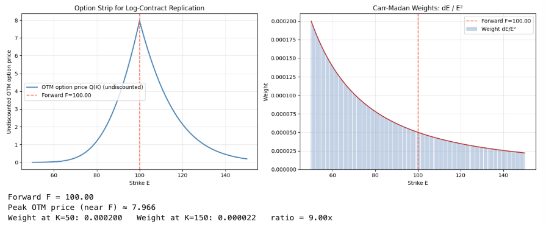

# Variance Swap Exposure 
# -- Extention to the Project *Hedging Analysis with Greeks*

## Overview
- This project is an extension of the project *Hedging Analysis with Greeks*. It extends the framework from delta-hedged vanilla call options to variance-linked exposure. This framework mirrors how variance swaps and VIX are priced and hedged on volatility desks.
- A variance swap is a forward contract on realized variance. Its fair strike can be replicated model-free using a static portfolio of European options, the Carr-Madan log-contract strip.

- It develops connections from three perspectives:
1. the continuous-time log-contract replication identity;
2. the trading interpretation through a short log contract and constant-dollar stock hedge;
3. the static pricing of the fair variance strike implied by the OTM option strip.

- The numerical experiments include discrete realized-variance estimators, normalized dollar-gamma exposures, and a VIX-style discretization of the continuous option-strip formula.

## Objective
- The project derives the continuous-time variance-replication identity, validates discrete estimators and convergence, and constructs a delta-hedged log-contract portfolio. It also compares normalized dollar-gamma weights for a vanilla call versus a short log contract, and derives the fair variance strike together with a VIX-style discretization of the continuous option strip.

## Methodology
**Theoretical:**
- Variance swap replication identity via Itô's lemma.

The integral form is:

 $$ 
 \int_0^T \frac{dS_t}{S_t} - \log \frac{S_T}{S_0} = \frac{1}{2} \int_0^T \sigma_t^2 dt \quad \text{replication 1 }
 $$
 
$\int_0^T \sigma_t^2 dt$ is the integrated realized variance, continuously sampled log-price quadratic variation, $\langle \log S \rangle_T$

- Delta-hedged log-contract portfolio construction(omit cash account).

$$\pi = -\log S_t + \Delta_t S_t, \qquad \Delta_t = \frac{1}{S_t}$$

$$ d\pi = -d\log S_t + \frac{1}{S_t} dS_t $$

$$ = -\frac{dS_t}{S_t} + \frac{1}{2}\sigma_t^2 dt + \frac{1}{S_t} dS_t $$

$$ = \frac{1}{2}\sigma_t^2 dt $$

- Carr-Madan static replication/Breeden-Litzenberger density.

PDF formula based on Breeden-Litzenberger result is:

$$ p(S_T = E) = \frac{d^2 \widetilde{V}_{call}(E, T)}{dE^2} = \frac{d^2 \widetilde{V}_{put}(E, T)}{dE^2} $$

The static option strip replication formula is:

$$
\mathbb{E}[g(S_T)|S_t] = g(F) + \int_0^F \widetilde{V_{\text{put}}}(E) g''(E)\,dE + \int_F^\infty \widetilde{V_{\text{call}}}(E) g''(E) dE \quad \text{replication 2 } 
$$

It is the static-replication formula, requires no rebalancing, and is model-independent.

For a log contract, payoff $g(S_T) = \log\left(\frac{S_T}{F}\right)$

so:

$$ \mathbb{E}[g(S_T)|S_t] = \mathbb{E}\left[ \log\left(\frac{S_T}{F}\right) \right] = -\int_0^F \widetilde{V}_{put}(E) \frac{1}{E^2} dE - \int_F^\infty \widetilde{V}_{call}(E) \frac{1}{E^2} dE $$

Since:

$$
\mathbb{E}^{\mathbb{Q}} \left[ \int\limits_{0}^{T} \sigma_{t}^{2}   dt \right] = -2   \mathbb{E}^{\mathbb{Q}} \left[ \log \frac{S_T}{S_0} \right]
$$

$$
\mathbb{E}^{\mathbb{Q}} \left[ \int\limits_{0}^{T} \sigma_{t}^{2}   dt \right] = 2 \left[ \int_{0}^{F} \widetilde{V}_{put}(E) \frac{1}{E^{2}}   dE + \int_{F}^{\infty} \widetilde{V}_{call}(E) \frac{1}{E^{2}}   dE \right]
$$

$$
E_{var} = \mathbb{E}^{\mathbb{Q}}[RV_T] = \mathbb{E}^{\mathbb{Q}} \left[ \frac{1}{T} \int\limits_{0}^{T} \sigma_{t}^{2}   dt \right]
$$

therefore:

$$ E_{var} = \frac{2}{T} \left[ \int_0^F \widetilde{V}_{put}(E) \frac{1}{E^2} dE + \int_F^\infty \widetilde{V}_{call}(E) \frac{1}{E^2} dE \right] $$

$E_{var} :$ fixed leg, pre-agreed at inception, variance level

**Numerical:**
- Discrete form of realized log-return variance(benchmark).

The formula for standard discretely monitored realized variance:

$$ RV = \sum_i \left( \log \frac{S_{t_i}}{S_{t_{i-1}}} \right)^2 $$

The discrete increment is:

$$ RV_{log,i} = \left( \log \frac{S_{t_i}}{S_{t_{i-1}}} \right)^2 $$

- Discrete estimator convergence analysis.

The discrete form of variance swap replication identity is:

$$ RV_{rep} = 2 \sum_i \frac{S_{t_i} - S_{t_{i-1}}}{S_{t_{i-1}}} - 2\log \frac{S_T}{S_0} $$

The discrete increment is:

$$RV_{rep,i} = 2 \left[ \frac{S_{t_i} - S_{t_{i-1}}}{S_{t_{i-1}}} - \log \frac{S_{t_i}}{S_{t_{i-1}}} \right] $$

It is the discretely rebalanced log-contract estimator, the finite-grid portfolio expression.

- VIX-style discretization of the continuous option strip.

The formula is:

$$ VIX^2 \approx \frac{2}{T} \sum_i \frac{\Delta E_i}{E_i^2} Q_i(E_i) - \frac{1}{T} \left( \frac{F}{E_0} - 1 \right)^2 $$

Common numerical definition: $\Delta E_i = \frac{E_{i+1} - E_{i-1}}{2}$ , which is the trapezoidal quadrature rule.

**Notes:**
-  Two replications:

| Replication | Leg / Construction | Key Connection |
|-------------|-------------------|----------------|
| **Replication 1:** Realized variance by stock trading plus log payoff | Dynamic leg: continuous rebalancing of stock position; Static leg: a short position in the log contract | Linchpin is the log contract connection |
| **Replication 2:** Log contract by an option strip | Static: buy and hold portfolio of puts and calls, no dynamic trading of underlying | The 1/E^2 curvature kernel replicates the log payoff |

 

-  For a one-unit short log contract: constant variance-exposure weight is 1/2.
-  For two units, -2log(S_T/E) : produce unit variance exposure and correspond to the standard integrated-variance replication identity.

## Main Results
-  Across 5000 GBM paths with sigma = 0.2, the mean squared-log-return variance is 0.03999688, compared with 0.03999578 from the discrete portfolio replication estimator and the theoretical value 0.04.
- The mean replication error is $-1.10 \times 10^{-6}$ , with RMSE $4.02 \times 10^{-5}$.
- After equalizing initial variance exposure, the vanilla call and the short log contract begin with the same dollar-gamma weight. The call’s subsequent exposure changes with moneyness and remaining maturity, while the short log contract retains a constant weight.
- The short log contract removes the state-dependent dollar-gamma weighting of a vanilla option. It provides constant-weight exposure to the realized vs implied variance spread.
- Carr-Madan weights mechanically assign greater weight to lower strikes. Actual strike contributions depend on the product of option strip and weights.  

## Key Plots

### Replication Error & Components of Portfolio & Replication Difference

The results show that the mean replication error is on the order of $10^{-6}$, and the RMSE is $4.02 \times 10^{-5}$. Across 5000 simulated paths, the discretized replication strategy converges to the theoretical value.

The single-path plots show that the discrete portfolio estimator tracks squared log returns closely on a path-by-path basis. The two estimators differ by higher-order terms at finite dt, but their difference converges to zero as the grid becomes finer.

The plots show that the short log contract increment and constant-dollar stock-hedge gain are approximately mirror-image first-order exposures. A small second-order convexity gain approximates the squared log return. The finite-monitoring difference arises from higher-order return terms, and large positive or negative returns generate the visible spikes in the finite-monitoring difference.

### Simulated Underlying Path & Dollar Gamma Weight Comparison & Per-step P&L & Cumulative P&L

The plots show the  vanilla call’s dollar gamma is spiky and path-dependent, concentrated near the strike, while the log contract’s weight is a constant. The short log contract has constant instantaneous dollar-gamma exposure and therefore provides an idealized, moneyness-independent exposure to integrated variance, under the assumption of continuous diffusion and continuous rebalancing. 

###  Option Strip for Log-Contract Replication & Carr-Madan Weights

The left panel, the full OTM-option strip, depends on the market, while the right panel, the Carr-Madan weight is the discrete approximation to the log-contract curvature kernel, a fixed function of the strike grid. 

The 1/E^2 kernel assigns greater mechanical weight to low strikes; with negative equity skew, elevated downside-puts prices further increase their contribution.

## Project Report
Full project report *Variance Swap Replication*: [Project Report PDF](https://github.com/yuliniris/Quantitative-Finance-Projects/blob/main/Variance_Swap_Replication/Report/variance_swap_replication.pdf)

Full project report *Hedging Analysis with Greeks*: [Project Report PDF](https://github.com/yuliniris/Quantitative-Finance-Projects/blob/main/Hedging_Analysis_with_Greeks/Report/Hedging_Analysis_with_Greeks.pdf)

## Code Structure
- **replication error check:**     Validate the discrete variance-swap identity via Monte Carlo
- **dollar gamma weight:**    Compare path-dependent vanilla-call dollar gamma weight vs flat log contract weight
- **VIX-style discretization:**  Discretize the static option strip, compute Carr-Madan weights, strike contributions, and the numerical fair variance strike 

## Assumptions and Limitations
This project uses a simplified framework:
- The underlying asset follows geometric Brownian motion.
- Zero interest rates and dividends.
- Continuous diffusion, with no jumps.
- No stochastic volatility, transaction costs, bid-ask spreads, funding costs, or discrete hedging costs.
- The continuous replication identity is exact, but its implementation uses finite monitoring and therefore contains discretization error.
- The option-strip experiment uses synthetic Black-Scholes prices and an idealized dense strike grid.

## Future Work
Possible extensions include:
- Apply a volatility surface, such as local or stochastic volatility modeling, for dynamic replication and hedging
- Use a regime-switching model, such as Markov switching to simulate the actual volatility path
- Introduce a compound Poisson process to evaluate the effect of jumps
- Consider transaction costs and discrete hedging

## References
- Gatheral J. The Volatility Surface: A Practitioner’s guide
- Project workshop of CQF
- CBOE (2003) VIX white paper

